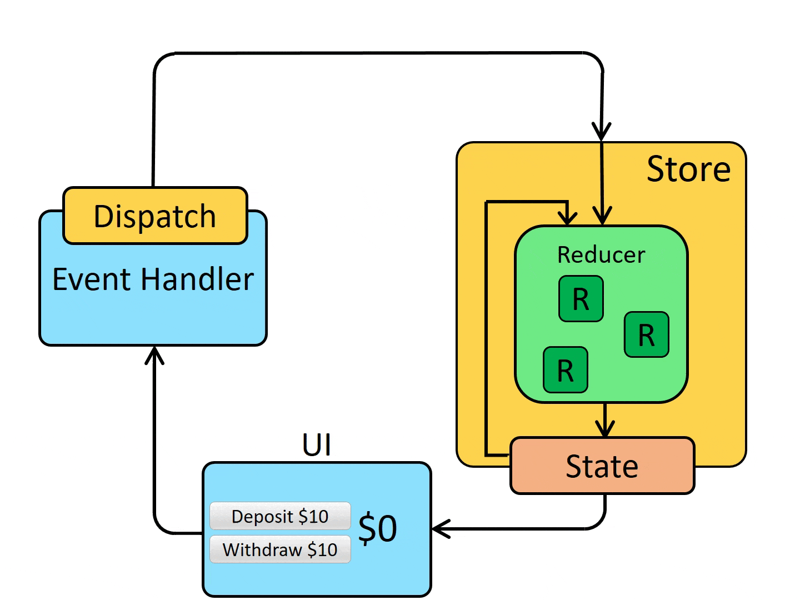

# What is Redux

- Redux is a global state management tool .
- It is like _context api_ built for huge apps
- Just like _context api_ , it too helps develpers escape from _props drilling_
- With the help of _Redux_ every component can access data kept inside the store

---

# Why was Redux Toolkit introduced & what problems does it solve?

- Classic Redux was incredibly powerful, but it had a major flaw: it required massive amounts of repetitive code (boilerplate) and complex configurations just to do simple tasks. Redux Toolkit (RTK) was introduced as the official, recommended way to write Redux logic.

- It solves the complexity problem by coming pre-configured with best practices and drastically reducing the amount of code you have to write.

# Key Players of Redux

* **The Store:** 
The Store is the "single source of truth." It is the giant JavaScript object that holds the entire global state of your application. There is always exactly one store per app.

* **Slices:** 
Since you only have one Store, things could get messy if you threw all your app's data into it randomly. A "Slice" is a way to divide that state into logical, feature-based pieces (e.g., a `cartSlice` for shopping, a `userSlice` for authentication, or a `todoSlice` for tasks).

* **Actions:** 
Actions are simply messengers. They are plain JavaScript objects that describe an event that just happened (e.g., "ADD_TASK") and optionally carry data related to that event (called the *payload*, like the actual text of the task).

* **Reducers:** 
Reducers are the decision-makers. A reducer is a function that takes the *current state* and the incoming *Action*, looks at what the action wants to do, and calculates the *new state*.

---
## Redux Workflow :-

---

### The React Connection & Data Flow

To connect your React components to the Redux Store, you use two primary hooks:

1. 
**`useSelector`:** The reader. Your components use this hook to subscribe to the Store and read specific pieces of data. If the data in the Store changes, the component automatically updates.

2. 
**`useDispatch`:** The trigger. Your components use this hook to send (or "dispatch") Actions to the Store.

**How does data flow inside Redux Toolkit?** Redux follows a strict "Unidirectional Data Flow". It always moves in one circular direction:

* A user clicks an "Add" button in a Component.
* The Component uses `useDispatch` to send an **Action**.
* The Store passes the Action to the correct **Reducer**.
* The **Reducer** calculates and updates the **Store's** state.
* The Component, listening via `useSelector`, sees the updated state and re-renders the UI.

